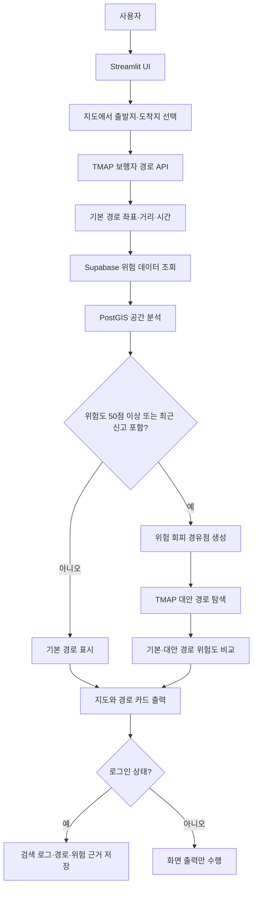

# 도시 생존 네비게이터


> 비 오는 날 야간 도보 이동 시 침수 구역, 도로 통제, 날씨, 사용자 신고를 함께 분석하여  
> 단순히 빠른 길이 아니라 **위험 근거를 설명하는 보행 경로**를 제공하는 Streamlit 웹 DB 응용 프로젝트입니다.

---

## 프로젝트 소개

기존 지도 서비스는 주로 거리와 예상 시간을 기준으로 경로를 안내합니다.  
**도시 생존 네비게이터**는 TMAP에서 받은 실제 보행 경로에 Supabase의 위험 데이터를 결합하고, PostGIS 공간 연산으로 경로와 위험 구역의 관계를 분석합니다.

사용자는 지도에서 출발지와 도착지를 직접 선택할 수 있으며, 시스템은 기본 경로의 위험도가 높거나 최근 신고가 포함된 경우 위험 회피 대안 경로를 추가로 탐색합니다. 경로별 거리, 예상 시간, 위험 점수, 포함된 신고 내용과 위험 사유를 화면에 표시하고, 로그인 사용자의 검색 결과는 Supabase에 저장합니다.

현재 데모 지역과 기본 지도 중심은 **연세대학교 미래캠퍼스 인근**으로 설정되어 있습니다.

---

## 최종 구현 상태

| 단계 | 구현 내용 | 상태 |
|---|---|---|
| 1단계 | Streamlit UI, Supabase 연결, 회원가입·로그인, 위험 신고·지도·조회 | 완료 |
| 2-1단계 | TMAP 보행자 경로 API, 지도 기반 출발지·도착지 선택, 경로 시각화 | 완료 |
| 2-1.5단계 | 위험 점수 분석, 최근 신고 반영, 위험 회피 대안 경로 추천 | 완료 |
| 2-2단계 | 검색 로그·경로 결과·위험 근거의 Supabase 트랜잭션 저장 | 완료 |
| 3단계 | PostGIS 공간 컬럼, 공간 인덱스, `ST_Intersects`·`ST_DWithin` 분석 | 완료 |

---

## 주요 기능

### 1. 사용자 인증

- Supabase Auth 기반 회원가입·로그인·로그아웃
- 회원가입 후 `profiles` 테이블에 닉네임 저장
- 로그인 세션을 `st.session_state`에 유지
- 사용자별 경로 검색 기록에 RLS 적용

### 2. 사용자 위험 신고

- 로그인 사용자가 지도에서 신고 위치 선택
- 위험 유형과 설명을 `user_reports`에 저장
- 신고 위치를 기준으로 `report_risk_zones`에 활성 위험 구역 생성
- 같은 사용자의 1분 이내 동일 유형 반복 신고 제한
- 30m 이내·10분 이내·동일 유형 신고는 중복 신고로 병합
- 중복 신고 수에 따라 위험 점수와 만료 시간 갱신

### 3. TMAP 실제 보행 경로 검색

- 지도 클릭으로 출발지·도착지 설정
- TMAP 보행자 경로 API 호출
- 실제 보행 거리, 예상 시간, 경로 좌표, 길 안내 수신
- 출발지·도착지 마커와 실제 경로 PolyLine 표시
- 출발·도착 바꾸기 및 초기화 지원

### 4. 위험 기반 경로 분석

경로에 다음 데이터를 반영합니다.

| 위험 출처 | 사용 데이터 | 분석 방식 |
|---|---|---|
| 침수 구역 | `flood_zones` | Polygon이 있으면 `ST_Intersects`, 없으면 중심점 100m 보조 판별 |
| 사용자 신고 | `report_risk_zones`, `user_reports` | 신고 반경과 경로를 `ST_DWithin`으로 분석 |
| 도로 알림 | `road_alerts` | 경로와 위험 지점의 근접 여부를 `ST_DWithin`으로 분석 |
| 날씨 | `weather_snapshots` | 최신 날씨 위험 점수를 모든 후보 경로에 공통 반영 |

위험 점수는 최대 100점으로 제한합니다.

### 5. 위험 회피 대안 경로 추천

다음 조건 중 하나를 만족하면 대안 경로를 추가 탐색합니다.

```text
기본 경로 총 위험도 ≥ 50점
또는
기본 경로에 활성 사용자 신고 포함
```

시스템은 위험 지점 주변에 우회 경유점을 생성해 TMAP 후보 경로를 요청하고, 기본 경로와 대안 경로의 위험도를 비교합니다.

화면에는 다음 정보가 표시됩니다.

- 기본 경로와 위험 회피 대안 경로
- 경로별 거리와 예상 시간
- 총 위험도와 최근 신고 건수
- 침수·도로 통제·날씨·사용자 신고 위험 근거
- 신고 내용, 신고 시각, 누적 신고 수
- 공간 판별 방법
- 침수 Polygon과 실제로 겹친 경로 길이
- 추천 또는 주의 사유

도로 구조상 완전한 우회가 불가능한 경우에는 대안 경로를 무조건 안전하다고 표현하지 않고, 기본 경로보다 위험도가 낮은지 여부를 별도로 안내합니다.

### 6. 검색 결과 자동 저장

로그인 상태에서 경로 검색에 성공하면 다음 세 테이블에 저장합니다.

```text
route_search_logs
        ↓
route_results
        ↓
route_risk_details
```

- `route_search_logs`: 사용자, 출발지·도착지, 검색 시각
- `route_results`: 추천 순위, 거리, 시간, 위험 점수, GeoJSON 경로, 추천 이유
- `route_risk_details`: 경로에 반영된 위험 출처, 유형, 점수, 상세 사유

더 안전하다고 판단된 경로는 `best`, 비교 경로는 `alternative_1`로 저장합니다.  
세 테이블 저장은 `save_route_recommendation` PostgreSQL RPC를 통해 하나의 트랜잭션으로 처리합니다.

로그인하지 않은 사용자는 경로 검색과 위험 비교는 가능하지만 검색 결과가 DB에 저장되지는 않습니다.

### 7. PostGIS 공간 분석

PostGIS 도입 후 다음 공간 자료형을 사용합니다.

| 테이블 | 공간 컬럼 | 자료형 |
|---|---|---|
| `flood_zones` | `geom` | `geometry(MultiPolygon, 4326)` |
| `route_results` | `route_geom` | `geometry(LineString, 4326)` |
| `report_risk_zones` | `geom` | `geography(Point, 4326)` |
| `road_alerts` | `geom` | `geography(Point, 4326)` |

주요 공간 연산은 다음과 같습니다.

```sql
ST_Intersects(route_line, flood_polygon)
ST_Intersection(route_line, flood_polygon)
ST_Length(intersection)
ST_DWithin(route_geography, risk_point_geography, radius_m)
```

- TMAP GeoJSON은 저장 시 PostGIS `LineString`으로 자동 변환됩니다.
- 침수 GeoJSON은 `MultiPolygon`으로 자동 변환됩니다.
- 사용자 신고와 도로 알림의 위·경도는 `geography(Point, 4326)`으로 자동 변환됩니다.
- 공간 컬럼에는 GiST 인덱스를 적용합니다.
- PostGIS RPC 오류 시 앱을 중단하지 않고 Python 거리 근사 방식으로 전환합니다.

---

## 시스템 동작 흐름



---

## 기술 스택

| 구분 | 기술 |
|---|---|
| Language | Python |
| Web UI | Streamlit |
| Database | Supabase PostgreSQL |
| Authentication | Supabase Auth |
| Spatial Database | PostGIS |
| Route API | TMAP 보행자 경로 API |
| Map | Folium, streamlit-folium |
| HTTP Client | Requests |
| Distance Calculation | geopy |
| Test | Python unittest |

---

## 프로젝트 구조

```text
project_split_fixed/
├── app.py                         # Streamlit 앱 진입점
├── config.py                      # 메뉴, 기본 좌표, 공통 설정
├── requirements.txt
├── README.md
├── .gitignore
│
├── .streamlit/
│   └── secrets.toml.example       # 비밀 설정 예시
│
├── components/
│   ├── sidebar.py                 # 공통 사이드바
│   └── map_components.py          # 지도, 마커, 경로, 위험 Polygon 렌더링
│
├── db/
│   ├── client.py                  # Supabase 클라이언트 및 세션 복원
│   └── queries.py                 # 위험 데이터 조회 함수
│
├── services/
│   ├── auth_service.py            # 회원가입·로그인·로그아웃
│   ├── risk_service.py            # 위험 신고와 간단 위험도 계산
│   ├── tmap_service.py            # TMAP 보행 경로 API 및 응답 파싱
│   ├── route_risk_service.py      # 경로별 위험 분석과 대안 경로 선택
│   ├── route_persistence_service.py # 검색 결과 저장 payload 및 RPC 호출
│   └── spatial_service.py         # PostGIS RPC 호출과 안전한 폴백
│
├── views/
│   ├── home.py
│   ├── auth.py
│   ├── risk_report.py
│   ├── risk_map.py
│   ├── risk_calculator.py
│   ├── db_viewer.py
│   └── route_search.py
│
├── sql/
│   ├── route_persistence.sql      # RLS 및 원자적 경로 저장 RPC
│   └── postgis_spatial_analysis.sql # PostGIS 컬럼·트리거·인덱스·분석 RPC
│
├── docs/
│   ├── risk_route_recommendation.md
│   ├── route_persistence.md
│   └── postgis_spatial_analysis.md
│
└── tests/
    ├── test_tmap_service.py
    ├── test_route_map.py
    ├── test_route_risk_service.py
    ├── test_route_persistence_service.py
    └── test_spatial_service.py
```

---

## 설치 및 실행

### 1. 저장소 복제

```bash
git clone https://github.com/xo0102/DB_project.git
cd DB_project
```

로컬 작업 폴더를 직접 사용하는 경우:

```bash
cd ~/Desktop/project_split_fixed
```

### 2. 가상환경 생성 및 활성화

```bash
python3 -m venv .venv
source .venv/bin/activate
```

### 3. 패키지 설치

```bash
python -m pip install --upgrade pip
python -m pip install -r requirements.txt
```

### 4. 비밀 설정 파일 생성

```bash
cp .streamlit/secrets.toml.example .streamlit/secrets.toml
```

`.streamlit/secrets.toml`에 실제 값을 입력합니다.

```toml
SUPABASE_URL = "본인 Supabase URL"
SUPABASE_KEY = "본인 Supabase publishable 또는 anon key"
TMAP_APP_KEY = "본인 SK open API appKey"
```

실제 `secrets.toml`은 `.gitignore`에 포함되어 있으므로 GitHub에 업로드하지 않습니다.

### 5. Supabase SQL 적용

Supabase Dashboard의 `SQL Editor`에서 다음 파일을 순서대로 실행합니다.

```text
1. sql/route_persistence.sql
2. sql/postgis_spatial_analysis.sql
```

첫 번째 SQL은 다음을 생성합니다.

- 경로 관련 테이블의 사용자별 RLS 정책
- 경로 검색 결과를 원자적으로 저장하는 `save_route_recommendation` RPC

두 번째 SQL은 다음을 생성합니다.

- PostGIS 확장
- 공간 컬럼과 변환 함수
- 기존·신규 데이터 동기화 트리거
- GiST 공간 인덱스
- `analyze_route_spatial` RPC
- `postgis_healthcheck` RPC

### 6. 앱 실행

```bash
python -m streamlit run app.py
```

---

## 사용 방법

1. 사이드바의 `회원가입`에서 계정을 생성합니다.
2. `로그인` 메뉴에서 로그인합니다.
3. 필요한 경우 `위험 신고`에서 지도 위치와 위험 내용을 등록합니다.
4. `경로 검색` 메뉴로 이동합니다.
5. `출발지` 선택 모드에서 지도를 클릭합니다.
6. 자동으로 `도착지` 선택 모드가 되면 목적지를 클릭합니다.
7. 경로 검색 버튼을 누릅니다.
8. 기본 경로와 위험 회피 대안 경로, 위험 점수와 상세 근거를 비교합니다.
9. 로그인 상태라면 검색 결과가 세 경로 테이블에 자동 저장됩니다.

---

## DB 테이블

| 테이블 | 역할 |
|---|---|
| `profiles` | 사용자 프로필 |
| `flood_zones` | 침수 이력·예상 구역과 위험 점수 |
| `road_alerts` | 도로 통제 및 이동 위험 공지 |
| `weather_snapshots` | 강수량과 날씨 위험 점수 |
| `user_reports` | 사용자가 입력한 원본 위험 신고 |
| `report_risk_zones` | 신고를 경로 분석에 반영하기 위한 활성 위험 구역 |
| `route_search_logs` | 사용자 경로 검색 요청 |
| `route_results` | 기본·대안 경로와 거리·시간·위험 점수 |
| `route_risk_details` | 경로별 침수·신고·도로·날씨 위험 근거 |

---

## 침수 Polygon 데이터 준비

PostGIS 기능을 적용해도 `flood_zones.geojson`에 유효한 Polygon 또는 MultiPolygon이 없으면 `geom`은 `NULL`로 남습니다.

현재 중심 좌표만 있는 샘플 데이터를 시연용 반경 100m Polygon으로 만들려면 Supabase SQL Editor에서 다음 SQL을 실행할 수 있습니다.

```sql
update public.flood_zones
set geom = ST_Multi(
    ST_Buffer(
        ST_SetSRID(
            ST_MakePoint(center_lng, center_lat),
            4326
        )::geography,
        100
    )::geometry
)
where geom is null
  and center_lat is not null
  and center_lng is not null;
```

> 이 Polygon은 실제 침수 경계가 아니라 중심 좌표를 기준으로 생성한 **시연용 반경 100m 영역**입니다. 실제 서비스에서는 공공데이터의 침수 GeoJSON Polygon으로 교체해야 합니다.

---

## PostGIS 적용 확인

### 공간 컬럼 변환 개수 확인

```sql
select count(*)
from public.flood_zones
where geom is not null;
```

```sql
select count(*)
from public.route_results
where route_geom is not null;
```

`route_results.route_geom`이 1건 이상이면 저장된 TMAP GeoJSON이 PostGIS `LineString`으로 정상 변환된 것입니다.

### 실제 경로–침수 구역 교차 확인

```sql
select
    r.id as route_id,
    f.id as flood_zone_id,
    f.zone_name,
    ST_Intersects(r.route_geom, f.geom) as intersects
from public.route_results r
join public.flood_zones f
    on ST_Intersects(r.route_geom, f.geom)
where r.route_geom is not null
  and f.geom is not null;
```

조회 결과가 있으면 저장된 경로가 침수 Polygon과 실제로 교차한 것입니다.  
0행이어도 오류가 아니라 현재 저장된 경로와 침수 영역이 겹치지 않는다는 의미입니다.

---

## 테스트

전체 단위 테스트를 실행합니다.

```bash
python -m unittest discover -s tests -v
```

현재 테스트는 총 18개이며 다음 항목을 검증합니다.

- TMAP 응답의 거리·시간·LineString 파싱
- 대안 경로 요청 시 경유점 전달
- 출발지·도착지 마커와 경로 PolyLine 렌더링
- 기본 경로와 대안 경로 동시 표시
- PostGIS 침수 Polygon 지도 렌더링
- 50점 미만이어도 최근 신고가 있으면 대안 경로 생성
- 우회 경유점 생성과 더 안전한 경로 선택
- GeoJSON의 `[경도, 위도]` 좌표 순서
- 사용자 신고 상세 정보 보존
- DB 저장 RPC 응답 파싱
- PostGIS 교차 결과 파싱과 날씨 점수 결합
- PostGIS RPC 오류 시 Python 분석 폴백

---

## 보안 주의사항

다음 파일은 절대로 GitHub에 업로드하지 않습니다.

```text
.streamlit/secrets.toml
```

Git이 실제 비밀 파일을 추적하지 않는지 확인할 수 있습니다.

```bash
git ls-files | grep secrets.toml
```

정상이라면 다음 예시 파일만 출력되어야 합니다.

```text
.streamlit/secrets.toml.example
```

TMAP appKey 또는 Supabase Key가 화면이나 저장소에 노출된 경우 해당 서비스 콘솔에서 키를 교체해야 합니다.

---

## 현재 한계

- 기상청 API는 아직 실시간 연동되지 않았으며 `weather_snapshots`의 최신 저장 데이터를 사용합니다.
- 실제 공공 침수 Polygon이 없으면 중심 좌표 반경 방식 또는 시연용 Polygon을 사용합니다.
- 도로망 구조에 따라 위험을 완전히 피하는 대안 경로가 존재하지 않을 수 있습니다.
- 현재 UI는 데스크톱 Streamlit 환경을 중심으로 구성되어 있습니다.
- 본 프로젝트는 수업 프로젝트용 프로토타입으로, 실제 재난 상황의 유일한 판단 근거로 사용하기에는 추가 검증이 필요합니다.

---

## 향후 개선 방향

- 기상청 API 실시간 강수량·단기예보 연동
- 공공데이터 기반 실제 침수 Polygon 자동 적재
- TOPIS 또는 지역 도로 통제 데이터 자동 연동
- 경로 구간별 위험도 색상 시각화
- 도착 예상 시각을 고려한 미래 위험 예측
- 사용자 신고 신뢰도 및 관리자 검증 기능
- 위험 구역 자동 만료·정리 작업
- 모바일 화면 최적화
- 배포 환경의 비밀키·로그·오류 모니터링 강화

---

## 프로젝트 의미

이 프로젝트는 단순한 지도 UI를 넘어 다음 흐름을 실제로 구현했다는 점에 의미가 있습니다.

```text
외부 경로 API 호출
→ 데이터베이스 위험 정보 조회
→ 공간 데이터 분석
→ 위험 기반 경로 비교
→ 추천 이유 설명
→ 결과의 관계형 DB 저장
```

이를 통해 Supabase PostgreSQL, RLS, RPC, GeoJSON, PostGIS 공간 자료형과 공간 함수를 하나의 웹 DB 응용 안에서 함께 활용했습니다.
